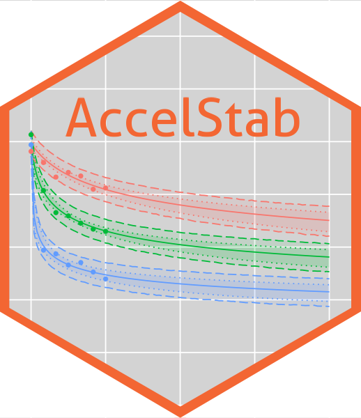

<!-- README.md is generated from README.Rmd. Please edit that file -->

# Accelerated Stability Kinetic Modelling 

<!-- badges: start -->

[](https://lifecycle.r-lib.org/articles/stages.html#stable)

[](https://cran.r-project.org/package=AccelStab)

<!-- badges: end -->

## Overview

This package utilises the Šesták–Berggren equation alongside the
Arrhenius equation to make a simple and consistent way for a user to
carry out the calculations and predictions required by accelerated
stability studies. Currently the package works with decreasing
variables, you may choose to transform your increasing variable into a
decreasing one but note that your choice of transformation can impact
the outcome.

The available functions within the package are as follows:

- `step1_down()` Fit the one-step Šesták–Berggren kinetic model.
- `step1_down_basic()` Quickly fit the one-step Šesták–Berggren kinetic
  model.
- `step1_down_rmse()` Calculate Root Mean Square Error (RMSE) for the
  one-step Šesták–Berggren kinetic model.
- `excursion()` Predict a temperature excursion for a product.
- `step1_plot_CI()` Plot the stability data and visualise the
  predictions with confidence intervals.
- `step1_plot_desc()` Plot raw accelerated stability data.
- `step1_plot_diagnostic()` Generate residual diagnostic plots from a
  step1_down fit.
- `step1_plot_PI()` Plot the stability data and visualise the
  predictions with prediction intervals.
- `step1_plot_pred()` Plot the stability data and visualise the
  predictions.
- `step1_plot_T()` Plot the stability data and visualise the predictions
  with focus on one temperature.
- `step1_sample_mvt()` Take a selected number of samples from the
  multivariate t distribution (mvt).

## Installation

Install AccelStab the following way -

``` r
install.packages("AccelStab")
library(AccelStab)
```

## Feedback

Log an [issue](https://github.com/AccelStab/AccelStab/issues) here or
contact a moderator.
