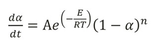
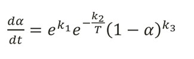
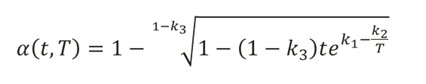
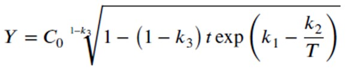
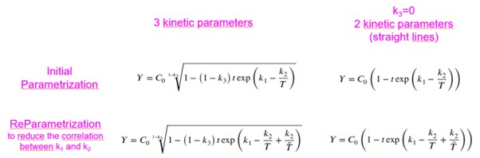

```{r, include = FALSE}
knitr::opts_chunk$set(
  collapse = TRUE,
  comment = "#>"
)
```
## Background Theory

This package utilises the Šesták–Berggren equation alongside the Arrhenius equation
to make a simple and consistent way for the user to carry out the calculations and
predictions required by accelerated stability studies. Currently the package is
only able to work with decreasing variables, you may choose to transform your
increasing variable into a decreasing one but note that your choice of
transformation can have a large impact on the outcome.

Accelerated stability studies aim to estimate the long-term stability of a given
compound when a study must be carried out over a shorter period. To achieve this,
these studies expose the compound to multiple temperatures, some of which exceed
the intended storage temperature (causing them to degrade faster hence
‘accelerated’ stability). This approach is feasible due to the consistent
degradation parameters across various temperatures. This practice enhances the
accuracy of stability estimations and reduces the time frame for studies.

The equation which the package relies on is as follows:

```{r echo=FALSE, fig.align='center'}



```
 
Where:
&alpha; – Degradation, A – Collision frequency factor, E – Activation Energy, 
R – Universal gas constant, T – Temperature (Kelvin), t – Time, n – Reaction order

This is simplified to this format:

```{r echo=FALSE, fig.align='center'}



```
 
Which is possible to integrate, solving for degradation as a function of time and temperature:

```{r echo=FALSE, fig.align='center'}



```
 
This equation for degradation makes the basis of our estimations. We also know that a response variable Y is equal to some initial value C0 multiplied by 1 – degradation. Which gives the equation for the response variable as:

```{r echo=FALSE, fig.align='center'}



```
 
Now this is what is referred to as the ‘initial parameterisation’ with ‘3 kinetic parameters. The package does allow for both properties to be altered as the user desires. This grid gives an overview of those alterations and below the explanations for why one might use them are given.

```{r echo=FALSE, out.width='700px', out.height='200px', fig.align="center"}



```

The purpose of reparameterisation is to reduce correlation between the k1 and k2 values. However, our personal view is that this is not necessary as the Levenberg-Marquardt algorithm used to fit the parameters is robust to correlation and results are very similar whether this is used or not. 

The purpose of setting k3 equal to zero is for a case when there is zero kinetic order, and the reaction is linear. If you are unaware of whether this is the case for you a warning will pop up when you run step1.down if its estimates k3 to be zero or near zero.
